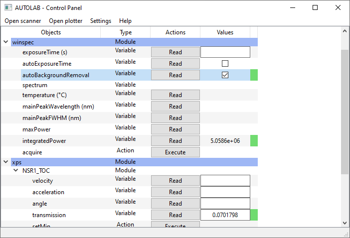

# Autolab
__Python package for scientific experiments automation__

The purpose of this package it to provide easy and efficient tools to deal with your scientific instruments, and to run automated experiments with them, by command line instructions or through a graphical user interface (GUI).

Created by Quentin Chateiller, Python drivers from Quentin Chateiller and Bruno Garbin, for the C2N-CNRS (Center for Nanosciences and Nanotechnologies, Palaiseau, France) ToniQ team.
New drivers and autolab updates created by Jonathan Peltier, for the C2N, Minaphot team.

Visit https://autolab.readthedocs.io/ for the full documentation of this package.

Drivers made for this package can be found at https://github.com/autolab-project/autolab-drivers

## Overview

## GUI example

