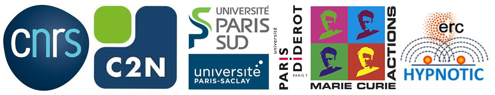

.. _about:

About
=====

This Python package has been created in 2019 by `Quentin Chateiller <https://www.linkedin.com/in/quentinchateiller/>`_ (PhD student) and Bruno Garbin (post-doc researcher) from the `ToniQ team <https://toniq.c2n.universite-paris-saclay.fr/fr/>`_ of the `C2N-CNRS laboratory <https://www.c2n.universite-paris-saclay.fr/fr/>`_ (Center for Nanosciences and Nanotechnologies, Palaiseau, France).

The first developments of the core, the GUI, and the drivers started initially in 2017 by Quentin.
Bruno arrived in the team in 2019, providing a new set of Python drivers from its previous laboratory.
In order to propose a Python alternative for the automation of scientific experiments in our research team, we finally merged our works in a Python package based on a standardized and robust driver architecture, that makes drivers easy to use and to write by the community.

From 2020 onwards, development was pursued by Jonathan Peltier (PhD Student) from the `Minaphot team <https://minaphot.c2n.universite-paris-saclay.fr/en/>`_.
In 2023, Mathieu Jeannin from the `Odin team <https://https://odin.c2n.universite-paris-saclay.fr/en/>`_ joined the adventure.

Thanks to Maxime, Giuseppe, Guilhem, Victor and Hamza for their contributions.

**You find this package useful?** We would be really grateful if you could help us to improve its visibility! You can:

* Add a star on the `GitHub page of this project <https://github.com/autolab-project/autolab>`_
* Spread the word around you
* Mention this package in your research publications

Contacts: `Autolab discussion <https://github.com/autolab-project/autolab/discussions>`_, `autolab-project@googlegroups.com <mailto:autolab-project@googlegroups.com>`_

