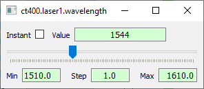

.. _control_panel:

Control panel
=============

The Autolab GUI Control Panel provides an easy way to control your instruments.
From it, you can visualize and set the value of its *Variables*, and execute its *Action* through graphical widgets.

.. image:: control_panel.png

Devices tree
------------

By default, the name of each local configuration in represented in a tree widget.
Click on one of them to load the associated **Device**.
Then, the corresponding *Element* hierarchy appears.
Right-click to bring up the close option.

The help of a given **Element** (see :ref:`highlevel`) can be displayed though a tooltip by passing the mouse over it (if provided in the driver files).

Actions
#######

A button **Execute** is present in each *Action* line.
Clicking the button executes the associated action.
If the *Action* has a parameter, fill its value in the associated widget.

Variables
#########

The value of a *Variable* can be set or read if its type is numerical (integer, float or boolean).

If the *Variable* is readable (read function provided in the driver), a **Read** button is available on its line.
When clicking on this button, the *Variable*'s value is read and displayed in a line edit widget (integer / float values) or in a checkbox (boolean).

If the *Variable* is writable (write function provided in the driver), its value can be edited and sent to the instrument (return pressed for interger / float values, check box checked or unchecked for boolean values).
If the *Variable* is also readable, a **Read** operation will be executed automatically after that.

To read and save the value of a *Variable*, right click on its line and select **Read and save as...**.
You will be prompted to select the path of the output file.

The colored displayed at the end of a line corresponds to the state of the displayed value:

	* The orange color means that the currently displayed value is not necessary the current value of the **Variable** in the instrument. The user should click the **Read** button to update the value in the interface.
	* The green color means that the currently displayed value is up to date (except if the user modified its value directly on the instrument. In that case, click the **Read** button to update the value in the interface).

Monitoring
----------

A readable and numerical *Variable* can be monitored in time (single point, 1D and 2D array versus time, 3D array represented as an image versus time).
To start the monitoring of this *Variable*, right click on it and select **Start monitoring**.
Please visit the section :ref:`monitoring`.

Slider
------

A readable and numerical *Variable* can be controled by a slider for convinient setting.
To open the slider of this *Variable*, right click on it and select **Create a slider**.

Scanning
--------

You can open the scanning interface with the associated button 'Open scanner' in the menu bar of the control panel window.
To configure a scan, please visit the section :ref:`scanning`.

Plotting
--------

You can open the plotting interface with the associated button 'Open plotter' in the menu bar of the control panel window.
See section :ref:`plotting`.
