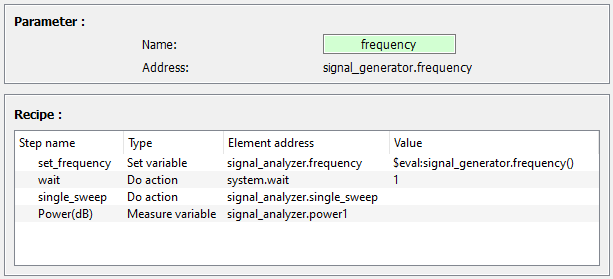

.. _control_panel:

Control panel
=============

The Control Panel provides an easy way to control your instruments.
From it, you can visualize and set the value of its *Variables*, and execute its *Action* through graphical widgets.

.. figure:: control_panel.png
	:figclass: align-center

	Control panel

Devices tree
------------

By default, the name of each local configuration is represented in a tree widget.
Click on one of them to load the associated **Device**.
Then, the corresponding *Element* hierarchy appears.
Right-click to bring up the close options.

The help of a given **Element** (see :ref:`highlevel`) can be displayed through a tooltip by passing the mouse over it (if provided in the driver files).

Actions
#######

A button **Execute** is present in each *Action* line.
Clicking the button executes the associated action.
If the *Action* has a parameter, fill its value in the associated widget.

Variables
#########

The value of a *Variable* can be set or read if its type is numerical (integer, float or boolean).

If the *Variable* is readable (read function provided in the driver), a **Read** button is available on its line.
When clicking on this button, the *Variable*'s value is read and displayed in a line edit widget (integer / float values) or in a checkbox (boolean).

If the *Variable* is writable (write function provided in the driver), its value can be edited and sent to the instrument (return pressed for integer/float values, check box checked or unchecked for boolean values).
If the *Variable* is readable, a **Read** operation will be executed automatically after that.

To read and save the value of a *Variable*, right click on its line and select **Read and save as...**.
You will be prompted to select the path of the output file.

The colored displayed at the end of a line corresponds to the state of the displayed value:

	* The orange color means that the currently displayed value is not necessarily the current value of the **Variable** in the instrument. The user should click the **Read** button to update the value in the interface.
	* The yellow color indicates that the currently displayed value is the last value written to the instrument, but it has not been read back to verify.
	* The green color means that the currently displayed value is up to date (except if the user modified its value directly on the instrument. In that case, click the **Read** button to update the value in the interface).

Monitoring
----------

A readable and numerical *Variable* can be monitored in time (single point, 1D and 2D array versus time, 3D array represented as an image versus time).
To start the monitoring of this *Variable*, right click on it and select **Start monitoring**.
Please visit the section :ref:`monitoring`.

Slider
------

A readable and numerical *Variable* can be controled by a slider for convenient setting.
To open the slider of this *Variable*, right click on it and select **Create a slider**.

	Slider

Scanning
--------

You can open the scanning panel with the associated **Scanner** button under the **Panels** sub-menu of the control panel menu bar.
To configure a scan, please visit the section :ref:`scanning`.

Plotting
--------

You can open the plotting panel with the associated **Plotter** button under the **Panels** sub-menu of the control panel menu bar.
See section :ref:`plotting` for more details.

Other features
--------------

Logger
######

A logger can be added to the control center using the variable ``logger = True`` in the section [control_center] of ``autolab_config.ini``.
It monitors every print functions coming from autolab GUI or drivers to keep track of bugs/errors.
It is inside a pyqtgraph docker, allowing to detached it from the control panel and place it somewhere visible.

Console
#######

A Python console can be added to the control center using the variable ``console = True`` in the section [control_center] of ``autolab_config.ini``.
It allows to inspect autolab or drivers while using the GUI for debugging purposes.

Executing Python codes in GUI
#############################

A function for executing python code directly in the GUI can be used to change a variable based on other device variables or purely mathematical equations.

To use this function both in the control panel and in a scan recipe, use the special ``$eval:`` tag before defining your code in the corresponding edit box.
This name was chosen in reference to the python `eval` function used to perform the operation and also to be complex enough not to be used by mistake, thereby preventing unexpected results.
The eval function only has access to all instantiated devices and to the pandas and numpy packages.

.. code-block:: python

	>>> # Usefull to set the value of a parameter in a recipe step
	>>> $eval:system.parameter_buffer()

	>>> # Useful to define a step according to a measured data
	>>> $eval:laser.wavelength()

	>>> # Useful to define a step according to an analyzed value
	>>> $eval:plotter.bandwitdh.x_left()
	>>> $eval:np.max(mydummy.array_1D())

	>>> # Usefull to define a filename that changes during an analysis
	>>> $eval:f"data_wavelength={laser.wavelength()}.txt"

	>>> # Usefull to add a dataframe to a device variable (for example to add data using the action `plotter.data.add_data`)
	>>> $eval:mydummy.array_1D()

It can also be useful in a scan for example to set the central frequency of a spectral analyzer according to the frequency of a signal generator. Here is an example to realize this measurement using ``$eval:``.

	Recipe using eval example

Autocompletion
###############

To simplify the usage of codes in GUI, an autocompletion feature is accesible by pressing **Tab** after writing ``$eval:`` in any text widget.

.. figure:: autocompletion.png
	:figclass: align-center

	Autocompletion, console and logger example
