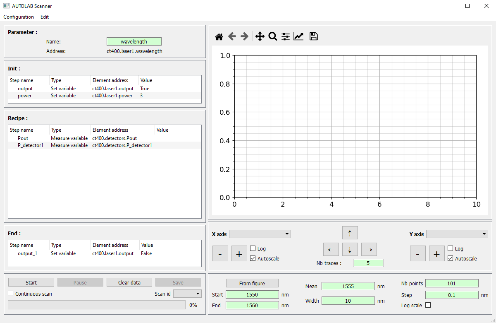

.. _extra:

Experimental features
=====================

Executing Python codes in GUI
#############################

A function for executing python code directly in the GUI can be used to change a variable based on other device variables or purely mathematical equations.

To use this function both in the control panel and in a scan recipe, use the special ``$eval:`` tag before defining your code in the corresponding edit box.
This name was chosen in reference to the python function eval used to perform the operation and also to be complex enough not to be used by mistake and produce an unexpected result.
The eval function only has access to all instantiated devices and to the pandas and numpy packages.

.. code-block:: none

	>>> # Usefull to have a recipe taking the loop number
	>>> $eval:system.parameter_buffer()

	>>> # Useful to define a recipe according to a measured data
	>>> $eval:laser.wavelength()

	>>> # Useful to define the recipe according to an analyzed value
	>>> $eval:plotter.bandwitdh.x_left()
	>>> $eval:np.max(mydummy.array_1D())

	>>> # Usefull to define a filename which changes during an analysis
	>>> $eval:"data_wavelength="+f"{laser.wavelength()}"+".txt"

	>>> # Usefull to add a dataframe to a device variable (for example to add data using the action plotter.data.add_data)
	>>> $eval:mydummy.array_1D()

It is also useful in a scan to set the frequency of a signal analyzer relative to the frequency of a signal generator. Here is a example of the recipe using ``$eval:`` to do so.

.. image:: recipe_eval_example.png

Executing init and end recipes
##############################

This feature allows to add and execute a recipe before and/or after the scan.
It is only accessible, for now, by dragging and dropping a variable form the control panel to the corresponding init or end tree of the scanner.
With this feature, it is possible within one config file to start instruments, set all the constant variables before the scan, do a scan, and turn off the instruments.

By default, the init and end recipe trees are hidden.
Use the layout slider to unhide them or, change the default tree size using the ``recipe_size`` option available in the ``autolab_config.ini`` file.

.. code-block:: none

    [scanner]
    recipe_size = [<init tree size>, <recipe tree size>, <end tree size>]
    recipe_size = [150, 500, 150]
