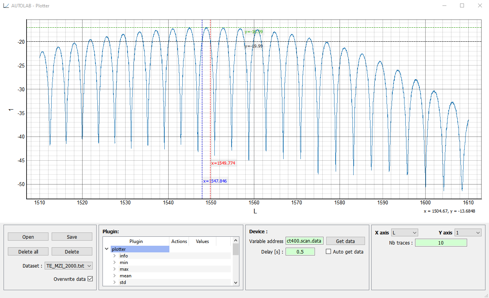

.. _gui:

Graphical User Interface (GUI)
==============================

Autolab is provided with a user-friendly graphical interface based on the **Device** interface, that allows the user to interact even more easily with its instruments. It can only be used for local configurations (see :ref:`localconfig`).

The GUI has four panels: a **Control Panel** that allows to see visually the architecture of a **Device**, and to interact with an instrument through the *Variables* and *Actions*. The **Monitoring Panel** allows the user to monitor a *Variable* over time. The **Scanning Panel** allows the user to configure the scan of a parameter and execute a custom recipe for each value of the parameter. The **Plotting Panel** allows the user to plot data.

.. figure:: control_panel.png
	:figclass: align-center

	Control panel

.. figure:: monitoring.png
	:figclass: align-center

	Monitoring panel

.. figure:: scanning.png
	:figclass: align-center

	Scanning panel

	Plotting panel

To start the GUI from a Python shell, call the ``gui`` function of the package:

.. code-block:: python

	>>> import autolab
	>>> autolab.gui()

To start the GUI from an OS shell, use:

.. code-block:: bash

	>>> autolab gui

.. toctree::
   :maxdepth: 1

   control_center
   monitoring
   scanning
   plotting
   extra
