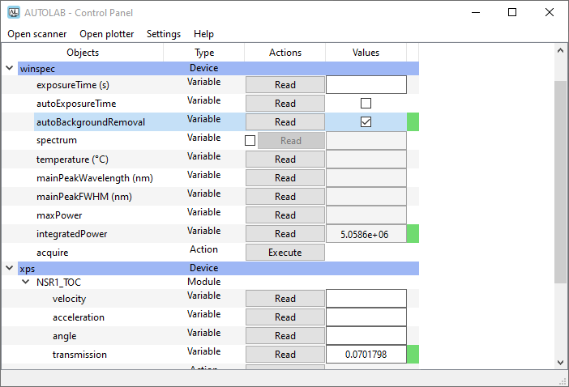
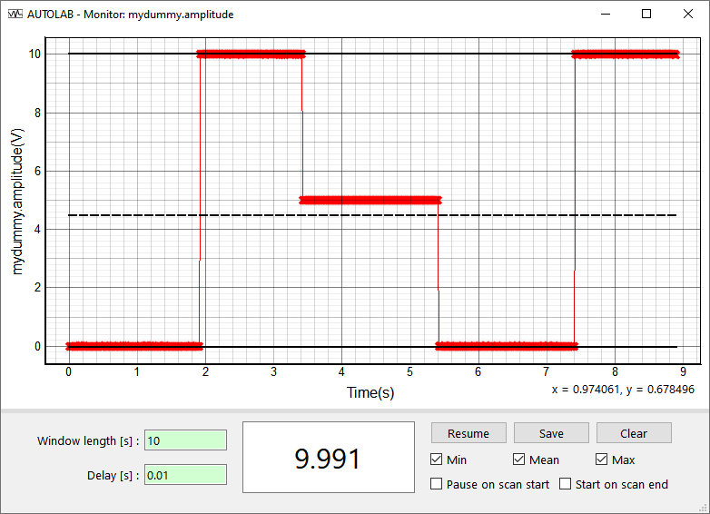

.. _gui:

Graphical User Interface (GUI)
==============================

Autolab is provided with a user-friendly graphical interface based on the **Device** interface, that allows the user to interact even more easily with its instruments. It can be used only for local configurations (see :ref:`local_config`).

The GUI has three panels : a **Control Panel** that allows to see visually the architecture of a **Device**, and to interact with an instrument through the *Variables* and *Actions*. The **Monitoring Panel** allows the user to monitor a *Variable* in time. The **Scanning Panel** allows the user to configure the scan of a parameter and the execution of a custom recipe for each value of the parameter.

	
	Control panel
	

	
	Monitoring panel
	
.. figure:: scanning.png
	:figclass: align-center
	
	Scanning panel

To start the GUI from a Python shell, call the function ``gui`` of the package:

.. code-block:: python

	>>> import autolab
	>>> autolab.gui()
	
To start the GUI from an OS shell, call:

.. code-block:: none

	>>> autolab gui
	

.. toctree::
   :maxdepth: 1
   
   control_center
   monitoring
   scanning

