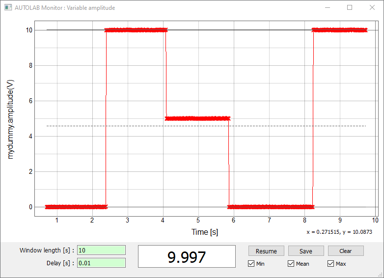
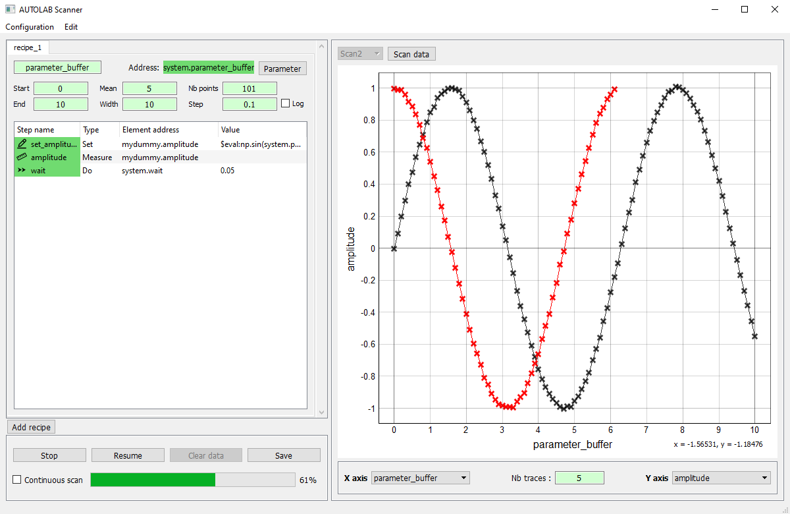

.. _gui:

Graphical User Interface (GUI)
==============================

Autolab is provided with a user-friendly graphical interface, that allows the user to interact even more easily with its instruments. 

The GUI has three panels : a **Control Panel** that allows to see visually the architecture of a device, and to interact with an instrument through the *Variables* and *Actions*. The **Monitoring Panel** allows the user to monitor a *Variable* in time. The **Scanning Panel** allows the user to configure the scan of a parameter and the execution of a custom recipe for each value of the parameter.

.. figure:: control_panel.png
	:scale: 60 %
	:figclass: align-center
	
	Control panel
	

	
	Monitoring panel
	

	
	Scanning panel

To start the GUI in a Python shell, call the function ``gui`` of the package:

.. code-block:: python

	>>> import autolab
	>>> autolab.gui()
		
To start the GUI directly from a Windows of Linux terminal (in a Python environment), juste enter the command ``autolab``:

Windows:

.. code-block:: none

	C:\Users\qchat> autolab
	
Linux:

.. code-block:: none

	quentin@myComputer:~$ autolab

.. toctree::
   :maxdepth: 1
   
   control_center
   monitoring
   scanning

