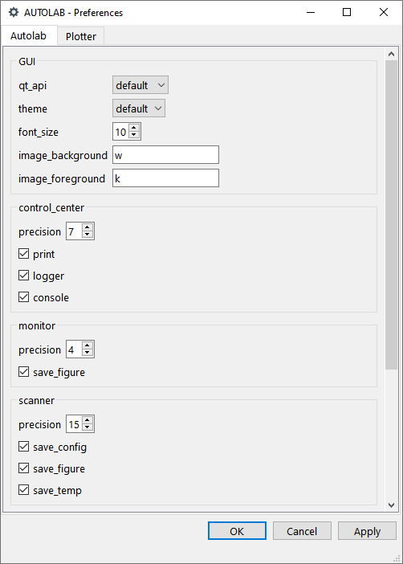
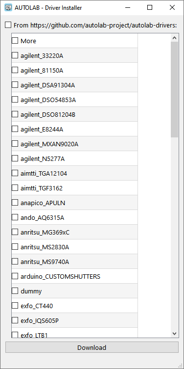
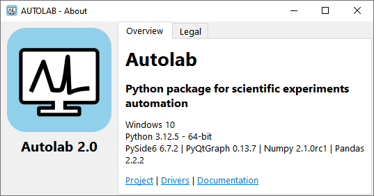
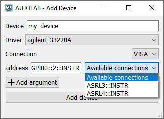
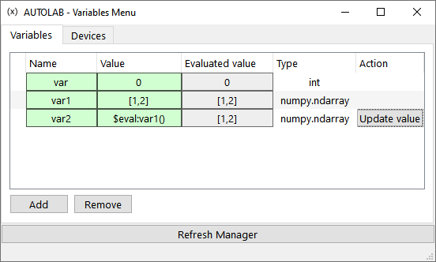

.. _miscellaneous:

Miscellaneous
=============

Preferences
-----------

The preferences panel allows to change the main settings saved in the autolab_config.ini and plotter_config.ini files.
It is accessible in the **Settings** action of the control panel menubar, or in code with ``autolab.preferences()``.

	Preference panel

Driver installer
----------------

The driver installer allows to select individual drivers or all drivers from the main driver github repository.
It is accessible in the **Settings** action of the control panel menubar, or in code with ``autolab.driver_installer()``.

	Driver installer

About
-----

The about window display the versions the autolab version in-used as well as the main necessary packages.
It is accessible in the **Help** action of the control panel menubar, or in code with ``autolab.about()``.

	About panel

Add device
----------

The add device window allows to add a device to the device_config.ini file.
It is accessible by right clicking on the empty area of the control panel tree, or in code with ``autolab.add_device()``.

	Add device panel

Variables menu
--------------

The variables menu allows to add, modify or monitor variables usable in the GUI.
When a scan recipe is executed, each measured step creates a variable usable by the recipe, allowing to set a value based on the previous measured step without interacting with the instrument twice.
It is accessible in the **Variables** action of both the control panel and scanner menubar, or in code with ``autolab.variables_menu()``.

	Variables menu
