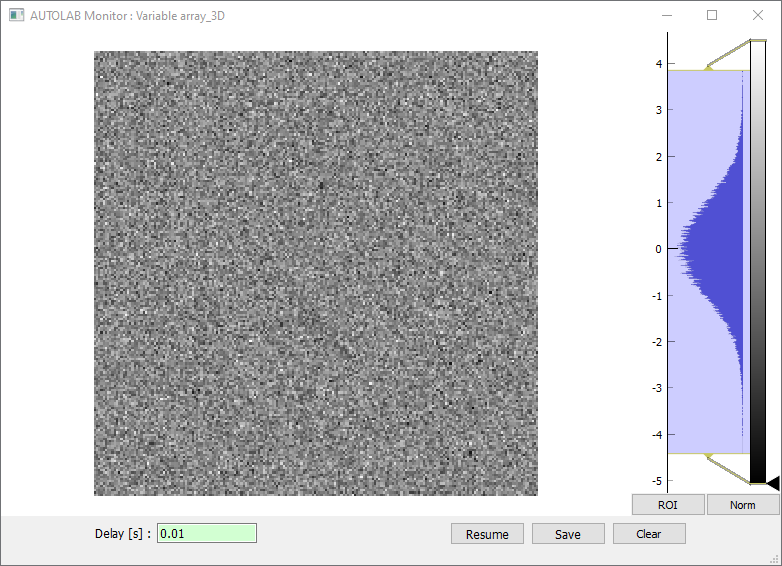

.. _monitoring:

Monitoring
==========

.. image:: monitoring.png

The Autolab GUI Monitoring allows you to monitor a *Variable* in time. To start a monitoring, right click on the desired *Variable* in the control panel, and click **Start monitoring**. This *Variable* has to be readable (read function provided in the driver) and numerical (integer, float value or 1 to 3D array).

In the Monitoring window, you can set the **Window length** in seconds. Any points older than this value is removed. You can also set a **Delay** in seconds, which corresponds to a sleep delay between each measure.

You can pause the monitoring with the **Pause** button, and save the current graph and data with the **Save** button. You will be prompted to give a folder path where the data will be saved.

You can clear the displayed data with the **Clear** button.

You can display a bar showing the **Min** or **Max** value reached since the beginning of the monitoring. Use the **Clear** button to start back with new min and max value.

The **Mean** option display the mean value of the currently displayed data (not from the beginning).

Thanks to the pyqtgraph package, it is possible to monitor images.

