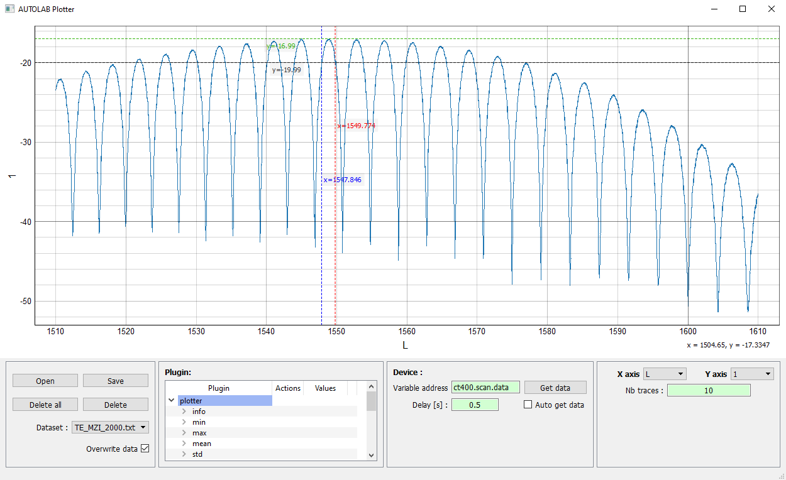

.. _plotting:

Plotting
========

The plotter is still in experimental phase at the moment (april 2023).
Import data
-----------

It is currently possible to plot data from previous experiments or any supported data type using the **Open** button.

Device connection
-----------------

It is also possible to plot a variable from an open device instance with an automatic plot refresh option.

To do this, you need to provide a **device variable**, e.g. ``mydummy.array_1D`` to create a link between the plotter and the ``array_1D`` variable of the ``mydummy`` device (based on the ``dummy`` driver).

Once the variable is linked, use the **Get data** button to call the variable that returns the array to be plotted (will execute the mydummy.array_1D() command).

To automatically update the plot, check the **Auto get data** option.

Analysis tool
-------------

An analysis box can currently be used to display a bandwidth around a local maximum of the displayed curve.
Note that a driver named ``plotter`` copies the analyze class and can be used to access bandwidth information for use in the control panel or directly in a scan recipe.

This tool box could in the future be a way to add custom analysis functions to the plotter.
