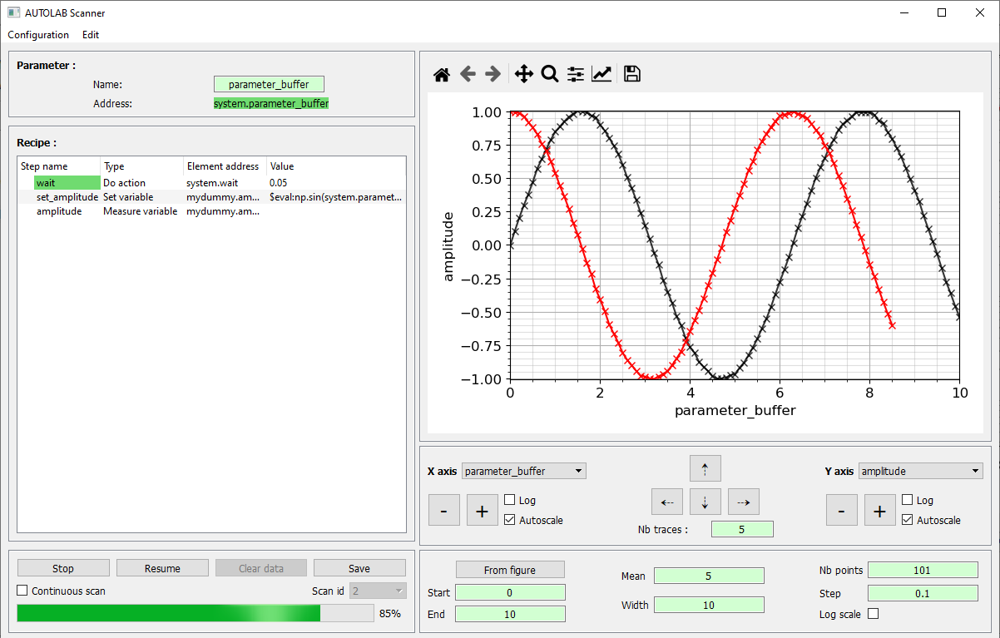

.. autolab documentation master file, created by
   sphinx-quickstart on Thu Oct  3 21:54:07 2019.
   You can adapt this file completely to your liking, but it should at least
   contain the root `toctree` directive.

Welcome to Autolab's documentation!
===================================

Autolab is a python package dedicated for scientific experiments control and automation. 

This package provides a set of drivers to communicate with scientific laboratory instruments in a user-friendly and straightforward way. The general control of these instruments can be done easily, either by command-line or through a graphical user interface (GUI). The GUI also contains useful tools to automate a scientific experiment, such as the monitoring in time of a variable, or the scan of a parameter with the execution of a custom recipe.

This is an example of basic instrument interaction by command-line in Python:

.. code-block:: python

	>>> import autolab
	>>> autolab.devices.list()
	['tunics','powermeter_exfo','winspec']
	>>> autolab.devices.tunics.wavelength(1550)
	>>> autolab.devices.powermeter_exfo.power()
	156.89e-6

Graphical scanning interface:

	
	
You find this package useful ? Please add a star on the `GitHub page of this project
<https://github.com/qcha41/autolab>`_ ! :-)
	
Table of contents:

.. toctree::
   :maxdepth: 1
   
   introduction
   installation
   command_line
   gui/index
   configuration
   command_line_advanced
   drivers
   about
   

