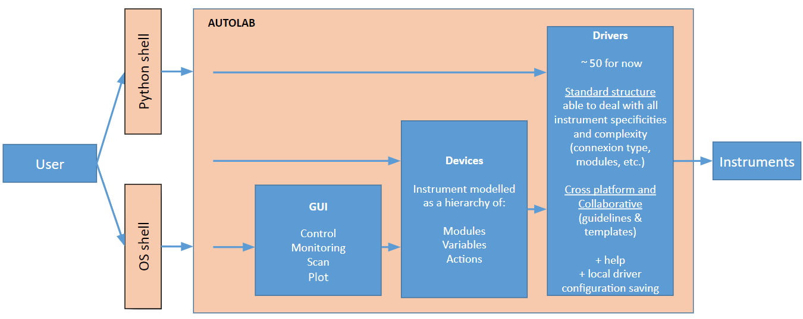

.. autolab documentation master file, created by
   sphinx-quickstart on Thu Oct  3 21:54:07 2019.
   You can adapt this file completely to your liking, but it should at least
   contain the root `toctree` directive.

Welcome to Autolab's documentation!
===================================

**"Forget your instruments, focus on your experiment!"**

Autolab is a Python package dedicated to control remotely any laboratory instruments and automate scientific experiments in the most user-friendly way. This package provides a set of standardized drivers for about 40 instruments (for now) which are ready to use, and is open to inputs from the community (new drivers or upgrades of existing ones). The configuration required to communicate with a given instrument (connection type, address, ...) can be saved locally to avoid providing it each time. Autolab can also be used either through a Python shell, an OS shell, or a graphical interface.

In this package, the interaction with a scientific instrument can be done through two different objects : the **Drivers**, or the **Devices**. 

	* The :ref:`lowlevel` provides a raw access to the package's drivers functions.

	.. code-block:: python

		>>> import autolab
		
		>>> laserSource = autolab.get_driver('yenista_TUNICS',connection='VISA',address='GPIB0::12::INSTR')
		>>> laserSource.set_wavelength(1550)
		>>> laserSource.get_wavelength()
		1550
		
		>>> powerMeter = autolab.get_driver('my_powermeter')
		>>> powerMeter.get_current_power()
		156.89e-6
		
		>>> stage = autolab.get_driver('my_stage')
		>>> stage.go_home()

	* The :ref:`highlevel`, are an abstraction layer of the low-level interface that provide a simple and straightforward way to communicate with an instrument, through a hierarchy of Modules, Variables and Actions objects. 

	.. code-block:: python

		>>> import autolab
		
		# Create the Device 'my_tunics'
		>>> laserSource = autolab.get_device('yenista_TUNICS',connection='VISA',address='GPIB0::12::INSTR')
		>>> laserSource.wavelength(1550)			# Set the Variable 'wavelength'
		>>> laserSource.wavelength()				# Read the Variable 'wavelength'
		1550
		
		>>> powerMeter = autolab.get_device('my_powermeter')	# Create the Device 'my_powermeter'
		>>> powerMeter.power()					# Read the Variable 'power'
		156.89e-6
		
		>>> stage = autolab.get_device('my_stage')		# Create the Device 'my_stage'
		>>> stage.home()					# Execute the Action 'home'

	The user can also interact even more easily with this high-level interface through a user-friendly :ref:`gui` which contains three panels: A Control Panel (graphical equivalent of the high-level interface), a Monitor (to monitor the value of a Variable in time) and a Scanner (to scan a Parameter and execute a custom Recipe).
	
	.. figure:: gui/scanning.png
		:figclass: align-center	
		
All the Autolab's features are also available through an :ref:`os_shell` interface (Windows and Linux) that can be used to perform for instance a quick single-shot operation without opening explicitely a Python shell. 

	.. code-block:: none

		>>> autolab devices my_tunics.wavelength -v 1551

.. note::
	**Useful links**: 
	
	* `Slides of our Autolab seminar (March 2020) <https://docs.google.com/presentation/d/1Uc6f0dEn6C18_0fr1pFuYSLmQ2AhIkVi9B5xTKfUIqw/edit?usp=sharing>`_
	* Github project: `github.com/qcha41/autolab <https://github.com/qcha41/autolab>`_
	* PyPi project: `pypi.org/project/autolab/ <https://pypi.org/project/autolab/>`_
	* Community & Support: `autolab-community.org <https://autolab-community.org/>`_
	

Table of contents:

.. toctree::
   :maxdepth: 1
   
   installation
   low_level/index
   high_level
   local_config
   gui/index
   shell/index
   help_report
   releases_notes
   about
   

